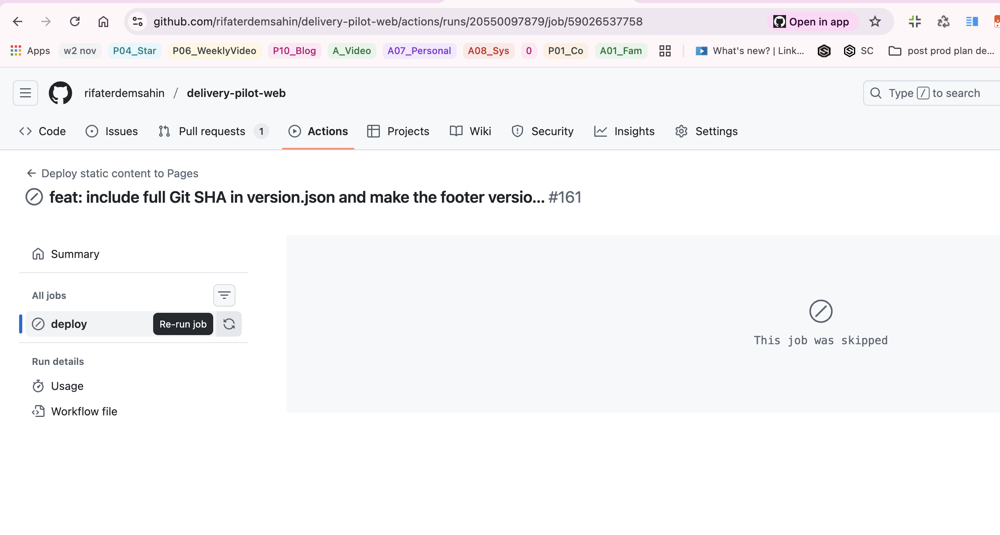

📅 Updated: 2025-12-28

# Feature Flag Deployment Formula

This document outlines how to control the static site deployment using a GitHub repository variable.

## Objective
To prevent accidental or unwanted deployments to GitHub Pages by gating the deployment job behind a feature flag.

## Feature Flag Configuration

*   **Variable Name:** `FEATURE_FLAG_DEPLOY`
*   **Target Value:** `true`

When this variable is set to `true`, the deployment workflow will run. If it is set to any other value or check, or if the variable does not exist, the deployment job will be skipped.

## How to Set Up

1.  **Navigate to Repository Settings:**
    *   Go to your GitHub repository.
    *   Click on **Settings** in the top navigation bar.

2.  **Access Variables:**
    *   In the left sidebar, verify **Secrets and variables**.
    *   Click on **Actions**.
    *   Select the **Variables** tab (next to the Secrets tab).

3.  **Create/Update Variable:**
    *   Click the green **New repository variable** button.
    *   **Name:** `FEATURE_FLAG_DEPLOY`
    *   **Value:** `true` (to enable deployment) or `false` (to disable deployment).
    *   Click **Add variable**.
  
  https://github.com/rifaterdemsahin/delivery-pilot-web/settings/variables/actions/new

## Usage in Workflow

The `.github/workflows/static.yml` file uses this variable in the `deploy` job's condition:

```yaml
jobs:
  deploy:
    if: ${{ vars.FEATURE_FLAG_DEPLOY == 'true' }}
    environment:
      name: github-pages
      # ...
```

## Troubleshooting

*   **Deployment Skipped:** If the deployment job is greyed out or skipped, check that the `FEATURE_FLAG_DEPLOY` variable exists in the repository settings and is exactly `true`.
*   **Variable Scope:** Ensure the variable is set at the Repository level (or Organization level if inherited), not just environment secrets/vars unless configured specifically. NOTE: The current implementation uses `vars.FEATURE_FLAG_DEPLOY` which typically refers to repository level variables available to all environments or specifically configured ones.

## How to Turn Off Deployment

To disable the deployment, you can change the value of the `FEATURE_FLAG_DEPLOY` variable.

1.  Navigate to **Settings** > **Secrets and variables** > **Actions** > **Variables**.
2.  Edit `FEATURE_FLAG_DEPLOY` and set the value to `false`.
3.  The next deployment will be skipped, as shown below:



